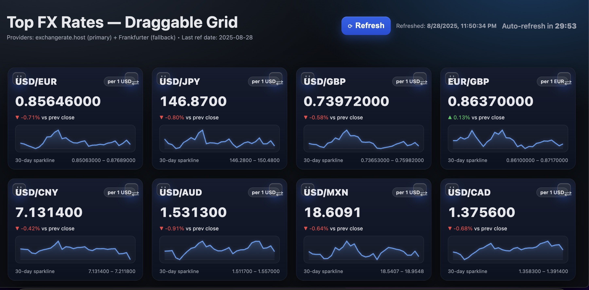

# HTML/Javascript FX Currency Dashbaord 
This Javascript HTML FX Currency dashboard that displays major
FX (Forgeign eXchange ) rates amongs some of the worlds most popular currency pairs.


## FX Dashbaord  : HTML

The entire application vibe coded using ChatGTP v5, is **depeendency free** and uses only modernbrowser html , css and javascript. to perform the following  stylish html page that displays in a stylish large format grid the most popular world currency exchange rates, it should pull dynamically the current currency rates from the ECB data. Inside each grid below the exchange rate it should have a last 30days sparklines chart. add a button to refresh the data and display next to the refresh time the last date/time it was refreshed. Make it so there are no CORS issues with local refresh



## Customization

You can add your own currency pairs by simply updating the pairs array 
code located near line 135. Simply add you're only currency pair

```
  // === Pairs ================================================================
  const PAIRS = [
    ["USD","EUR"], ["USD","JPY"], ["USD","GBP"], ["EUR","GBP"],
    ["USD","CNY"], ["USD","AUD"], ["USD","CAD"], ["USD","CHF"],["USD","MXN"],
    ["CHF","EUR"], ["USD","HKD"], ["USD","NZD"], ["USD","BRL"],
    ["USD","PHP"], 
  ];
  ```

## Installation
Simply clone  or download:

- git clone https://github.com/acbrandao/Javascript.git
- nagivate to Javascript_FXDashboard  folder
-  then simply open the ** rates.html** page in your browser.

## How to User

 Simply open the page in any browser, and it will autorefresh with the latest currency fx rates.

## Contributing
1. Fork it!
2. Create your feature branch: `git checkout -b my-new-feature`
3. Commit your changes: `git commit -am 'Add some feature'`
4. Push to the branch: `git push origin my-new-feature`
5. Submit a pull request :D
## History
TODO: Write history
## Credits
TODO: Write credits
## License
TODO: Write license.

