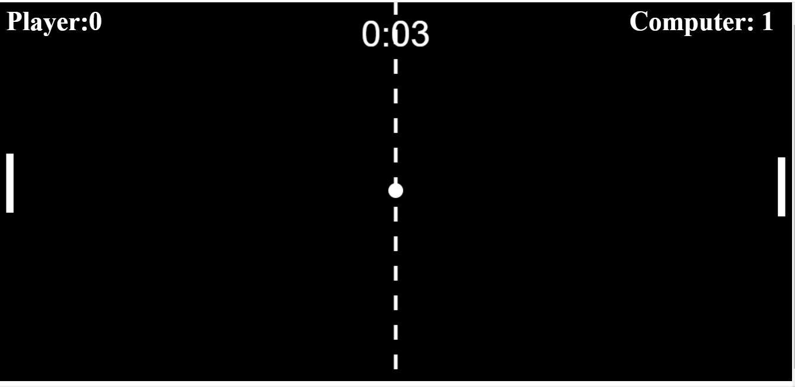

# HTML/Javascript Pong 
This Javascript HTML Pong Game was created mostly via prompts from chatGPT. It took a while , and its a lot more involveed than 
just saying, ChatGPT *Write me a Pong html game*

## The Game  : Pong

The first successful graphical video game is widely considered to be Pong, released in 1972. It was developed by Atari, founded by Nolan Bushnell and Ted Dabney, and was inspired by an earlier tennis game called "Tennis for Two" created in 1958 by physicist William Higinbotham. Pong was a simple game in which two players used paddles to hit a ball back and forth across a screen. It was an instant success, and it helped to popularize video games and launch the arcade industry.  graphical video game, You can find the fascinating history here..[https://en.wikipedia.org/wiki/Pong](Wikipedia Pong} borrowing elements form table/tenis, you simply use your digital paddle to hit the ball to the other side. 

this version uses HTML/Jaavscritp language to allwo a web browser playable game

## Installation
Simply clone  or download the few files into your webserver or file directory. then simply open the pong.html page in your browser.

## How to Play

 this is a 1-player game vs. the computer . Simply use the arrows (Up,Down) keys to mov ehte lef thand paddle, press [SPACEBAR] to restart the game.

## Contributing
1. Fork it!
2. Create your feature branch: `git checkout -b my-new-feature`
3. Commit your changes: `git commit -am 'Add some feature'`
4. Push to the branch: `git push origin my-new-feature`
5. Submit a pull request :D
## History
TODO: Write history
## Credits
TODO: Write credits
## License
TODO: Write license.

